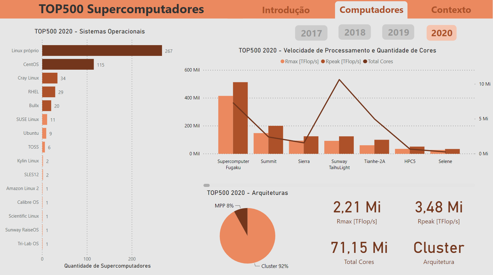

# TOP500 Data Analysis

O TOP500 (dês de 1993) é um projeto de pesquisa que ranqueia os 500 supercomputadores com maior capacidade de processamento do mundo todo. Ele acontece todos os semestres do ano e reúne uma grande quantidade de informação a respeito dessas máquinas, além da velocidade de processamento (flops/s) também é coletado dados sobre: hardware, localidade, finalidade, desenvolvedora, sistema operacional e mais.

Os dados da pesquisa são publicados ao final de cada semestre, em Junho e Novembro, em formato .xml e .xlsx. Comparando com os dados dos computadores mais antigos é possível extrair infromações super interessantes, como: o desenvolvimento dos hardwares e sua eficiência, paises pioneiros, sistemas operacionais mais populares, utilização de GPU's e outros auxiliadores, entre outros. O link a seguir é um dashboard que ilustra uma alguns dos dados disponibilizados pelo projeto.

https://app.powerbi.com/view?r=eyJrIjoiNGNmNGE1NDUtMjE2ZS00M2UwLTlmYzctOGNmNGE0NmMyZTk5IiwidCI6IjNhNzhiMGNkLTdjOGUtNDkyOS04M2Q1LTE5MGE2Y2MwMTM2NSJ9&pageName=ReportSection9c861e88032aac3377cc

